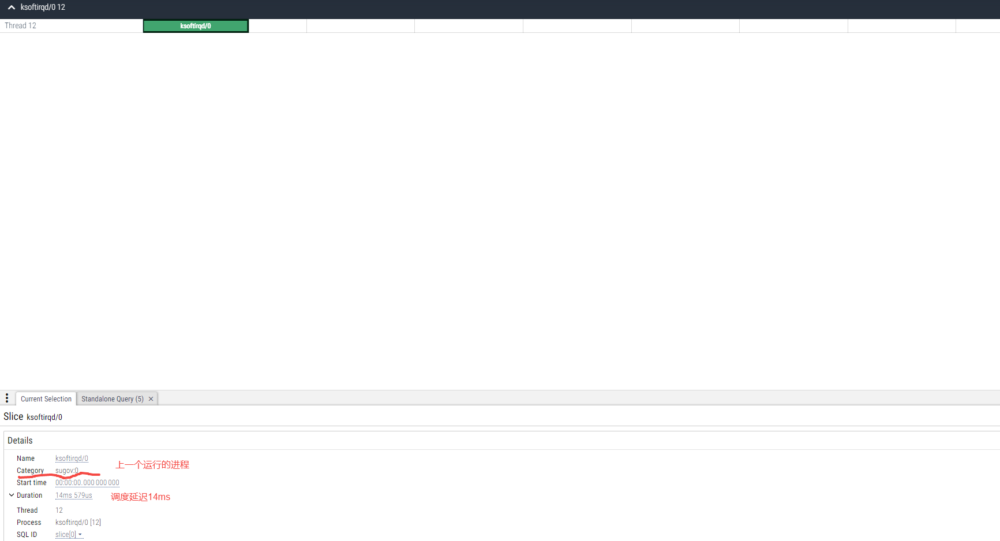

# 1. What is deepE?

deep Edge perf insight tools

deepE is a performance monitor and analysis tool specially developed for end-side devices. It can be used for edge devices such as autonomous vehicles and robots. deepE can make analyse system and performance problems more easier.

deepE is still experimental and you might experience bugs, but we're working very hard to make it stable as possible.

[Introduction](https://blog.csdn.net/happyAnger6/article/details/139602370?spm=1001.2014.3001.5501)

# 2. Usage examples

## 2.1 offcpu information


## 2.2 schedule latency information



# 3. How to start?

## 3.1 build docker image

```shell
docker build -t <docker-image-name> -f deepE/docker/Dockerfile.x86 .
```

## 3.2 run

```shell
docker run -ti --name deepE -v $(pwd):/deepE  -v /usr/src:/usr/src:ro  -v /lib/modules/:/lib/modules:ro -v /sys/kernel/debug/:/sys/kernel/debug:rw \
 --net=host --pid=host --privileged <docker-image> /bin/bash

~# deepE
bpf_prog:OffCpuBpf open events:offt_events
bpf_prog:RunqSlowerBpf open events:rqs_events
bpf looping...
```


# 4. Q && A
