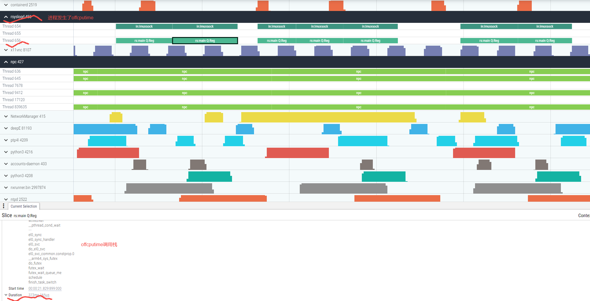

# deepE
deep Edge perf insight tools

deepE is a performance monitoring and analysis tool specially developed for end-side devices. It can be used for edge devices such as autonomous vehicles and robots.

## offcpu information

## schedule latency information

